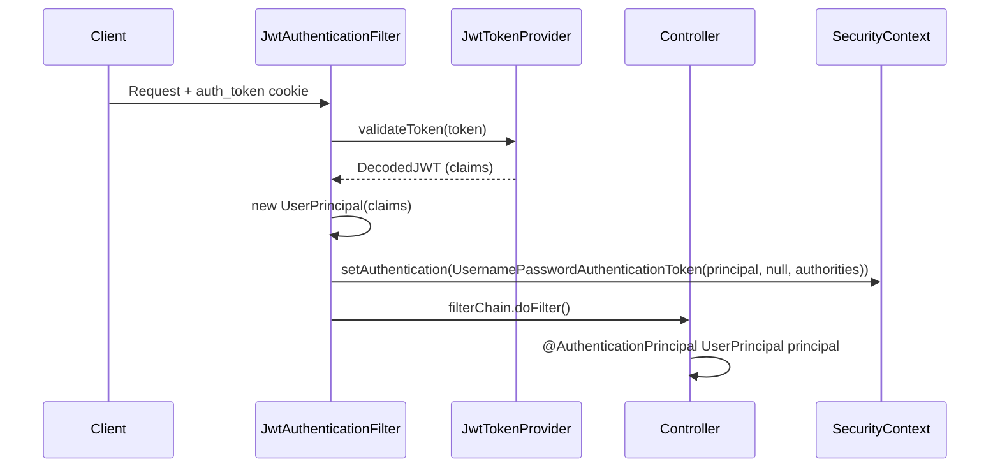

# Data Model: JWT Principal Wrapper

**Date**: 2026-07-16
**Feature**: specs/010-jwt-principal-wrapper

---

## UserPrincipal Record

### Definition

```java
package com.lionsclub.api.security;

import java.util.UUID;
import com.lionsclub.api.domain.user.Role;

public record UserPrincipal(
    UUID userId,
    String email,
    Role role,
    String firstName,
    String lastName
) implements java.security.Principal {

    @Override
    public String getName() {
        return email; // Identifies the principal for logging/audit
    }

    // Convenience method for display
    public String fullName() {
        return firstName + " " + lastName;
    }
}
```

### Fields

| Field | Type | Nullable | Description | Source |
|-------|------|----------|-------------|--------|
| `userId` | UUID | No | Unique user identifier | JWT `sub` claim |
| `email` | String | No | User email address | JWT `email` claim |
| `role` | Role | No | User role (MEMBER/ADMIN) | JWT `role` claim |
| `firstName` | String | No | User's given name | JWT `firstName` claim |
| `lastName` | String | No | User's family name | JWT `lastName` claim |

### Relationships

- **Created by**: `JwtAuthenticationFilter` from validated JWT claims
- **Consumed by**: Controllers via `@AuthenticationPrincipal`, Method security via SpEL
- **No persistence**: Transient security object — not stored in database
- **No UserDetails**: Does not implement Spring Security's `UserDetails` — custom principal

### Validation Rules

- `userId`: Valid UUID (validated by JWT signature verification)
- `email`: Valid email format (validated at registration, included in token)
- `role`: Must be `MEMBER` or `ADMIN` (validated at token creation)
- `firstName`/`lastName`: Non-blank (validated at registration)

---

## JWT Token Claims (Updated)

### Payload Structure

```json
{
  "sub": "550e8400-e29b-41d4-a716-446655440000",
  "role": "MEMBER",
  "email": "member@lionsclub.org",
  "firstName": "John",
  "lastName": "Doe",
  "iat": 1721145600,
  "exp": 1721232000
}
```

### Claims Mapping

| JWT Claim | Type | UserPrincipal Field | Required |
|-----------|------|---------------------|----------|
| `sub` | String (UUID) | `userId` | Yes |
| `role` | String | `role` (enum) | Yes |
| `email` | String | `email` | Yes |
| `firstName` | String | `firstName` | Yes |
| `lastName` | String | `lastName` | Yes |
| `iat` | NumericDate | — | Yes (standard) |
| `exp` | NumericDate | — | Yes (standard) |

### Token Generation (AuthService)

```java
// Before (2 claims + standard)
JWT.create()
    .withSubject(user.getId().toString())
    .withClaim("role", user.getRole().name())
    .withExpiresAt(expiry)
    .sign(algorithm);

// After (5 claims + standard)
JWT.create()
    .withSubject(user.getId().toString())
    .withClaim("role", user.getRole().name())
    .withClaim("email", user.getEmail())
    .withClaim("firstName", user.getFirstName())
    .withClaim("lastName", user.getLastName())
    .withExpiresAt(expiry)
    .sign(algorithm);
```

### Size Impact

| Version | Approximate Token Size |
|---------|------------------------|
| Before | ~350-400 bytes |
| After | ~400-500 bytes |
| Increase | ~50-100 bytes (< 1 KB) |

Well within cookie/header limits (4 KB cookie, 8 KB header typical).

---

## Authentication Flow (Updated)



---

## Impact on Existing Components

| Component | Change Type | Details |
|-----------|-------------|---------|
| `User` entity | None | Unchanged |
| `UserRepository` | None | Unchanged |
| `AuthService` | Modified | `createToken(user)` passes more fields |
| `JwtTokenProvider` | Modified | `validateToken()` returns claims; `createToken()` accepts more params |
| `JwtAuthenticationFilter` | Modified | Constructs `UserPrincipal` instead of String |
| `SecurityConfig` | None | `@EnableMethodSecurity` already present |
| `EventController` | Refactored | Uses `@AuthenticationPrincipal UserPrincipal` |
| `RsvpController` | Refactored | Uses `@AuthenticationPrincipal UserPrincipal` |
| `AuthController` | Refactored | Uses `@AuthenticationPrincipal UserPrincipal` |

---

## No Database Changes

- No Flyway migration required
- No schema modifications
- No new tables
- Principal is derived entirely from JWT (stateless)

---

## Security Considerations

1. **Token Integrity**: Claims are cryptographically signed — cannot be forged without secret
2. **No DB Lookup in Filter**: Eliminates N+1 query risk; all data in token
3. **Stale Data Risk**: If user profile changes (email/name), token reflects old data until re-login
   - Mitigation: Short token expiry (configurable via `JwtConfig`); refresh endpoint available
4. **Role Changes**: If admin promotes/demotes user, old token retains old role until expiry
   - Mitigation: Admin actions use short-lived tokens; consider token revocation for critical changes
5. **Principal Immutability**: Record ensures thread-safety in security context